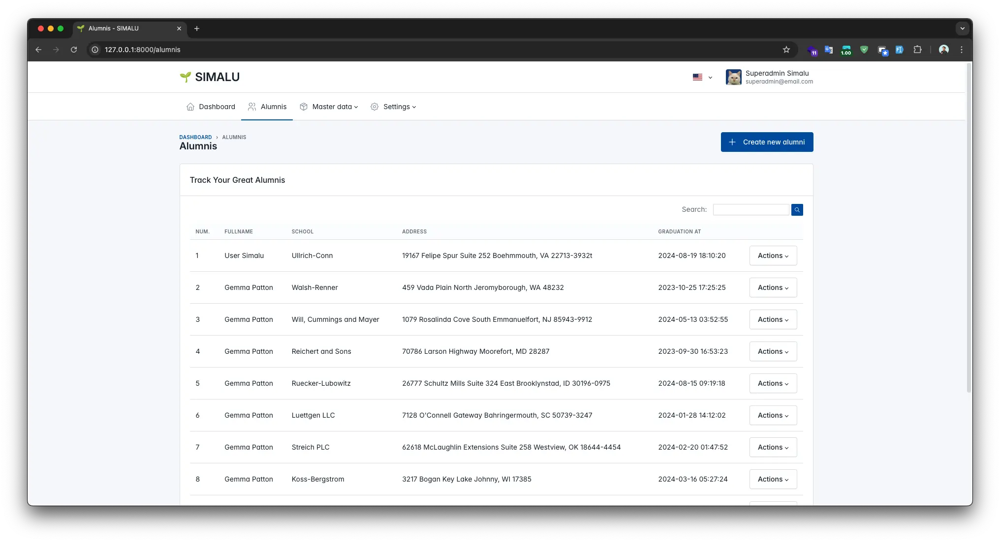

<p align="center"></p>

<p align="center">
    <a href="https://www.apache.org/licenses/LICENSE-2.0"></a>
    <a href="https://github.com/ibnumardini/simalu/stargazers"></a>
    <a href="https://github.com/ibnumardini/simalu/pulls"></a>
    <a href="https://github.com/ibnumardini/simalu/network"></a>
    <a href="https://github.com/ibnumardini/simalu/graphs/contributors"></a>
</p>

## SIMALU 🌱
#### SIMALU aka. Sistem Informasi Management Alumni is specialized software crafted to assist educational institutions and organizations in effectively overseeing alumni relations.

## Screenshots


Want to see more? Check out our [complete application screenshots](SCREENSHOT.md) to explore all the features and interfaces.

## Quick start
1. First of all, you can download the [zip](https://github.com/ibnumardini/simalu/archive/refs/heads/master.zip) or clone this project.
   
   ```sh
   git clone https://github.com/ibnumardini/simalu.git
   ```
   
2. Jump straight into the project.
   
   ```sh
   cd simalu/
   ```
   
4. Generate a new key.

   ```sh
   php artisan key:generate
   ```
   
6. Fill the .env settings to the current environment.

   If you want to enable Google Login/Register, set these variables too:

   ```sh
   GOOGLE_CLIENT_ID=
   GOOGLE_CLIENT_SECRET=
   GOOGLE_REDIRECT_URI="${APP_URL}/auth/google/callback"
   ```

   Configure the same callback URL in your Google Cloud OAuth credentials.
7. Run the database migrations.

   ```sh
   php artisan migrate
   ```
   
9. Run the database seeder.

   ```sh
   php artisan db:seed
   ```
   
11. Start the server app.
    ```sh
    php artisan serve --host=0.0.0.0 --port=8000
    ```
    
## Community
Feel free to join our [Discord server](https://discord.gg/FnHMcUYF) if you have ideas, feedback, suggestions, or just want to be part of our community.

## Contributing
Thank you for your interest in contributing to SIMALU, Please follow the [Contribution Guide](https://github.com/ibnumardini/simalu/blob/master/CONTRIBUTING.md) to get started.

## License
SIMALU is licensed under the [Apache-2.0 License](https://www.apache.org/licenses/LICENSE-2.0).
